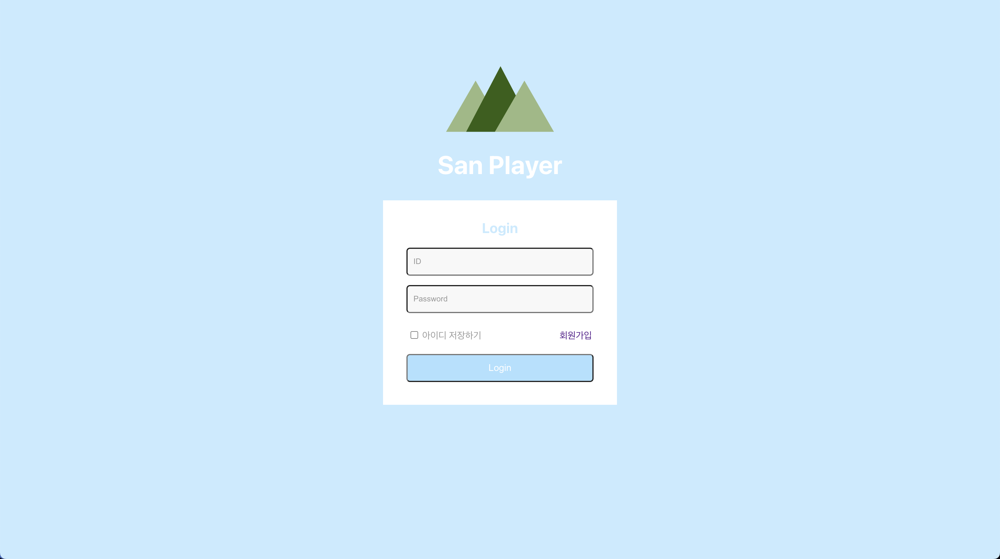
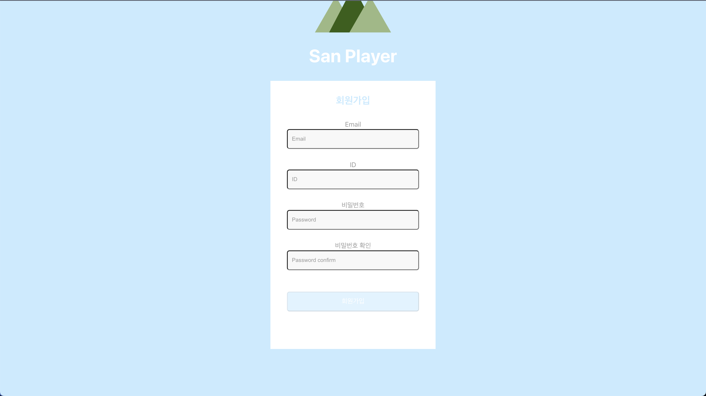
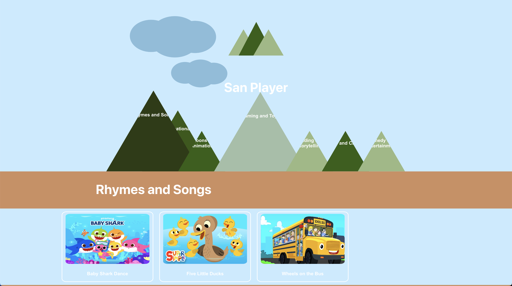
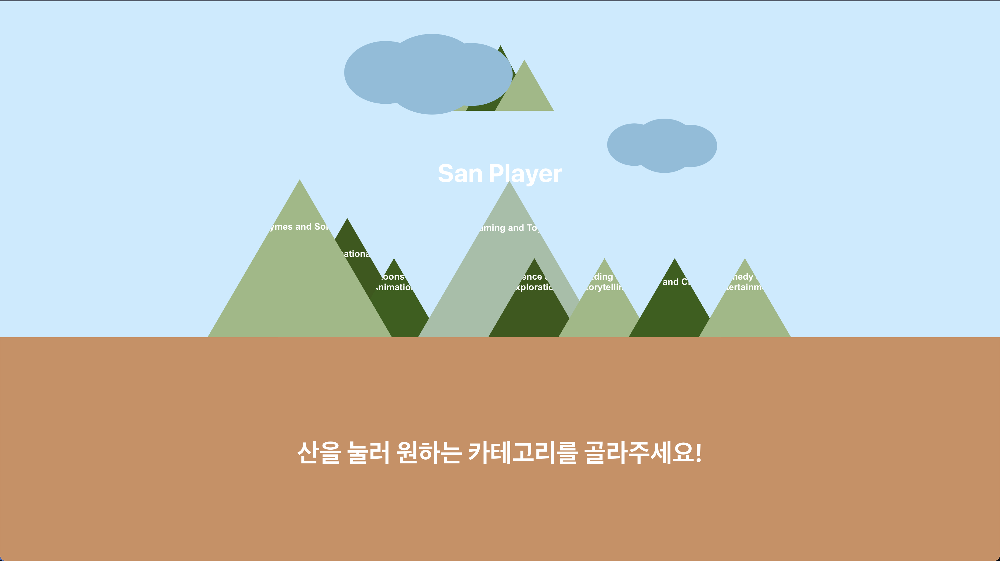
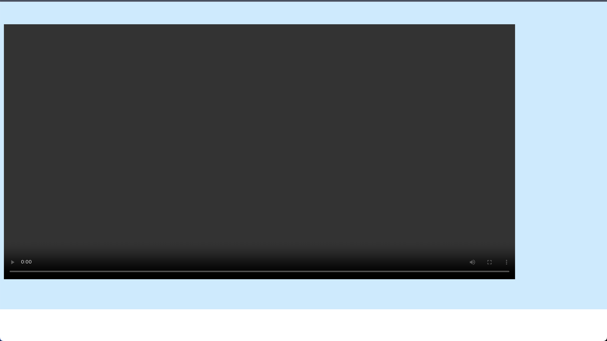

# san_player

참고링크 (https://github.com/Hosang10Lee/opennotes/tree/main/termproject)


|이름|학번|역할|
|---|---|---|
|김산|2019147507|front, 해상도 설정 기능 담당|
|박민수|2020147545|front, 배속 기능 담당|
|박서정|2020147509|back, DB, 스트리밍 품질 데이터 저장 기능 담당|
|이수민|2020144055|back, 스트리밍 품질 데이터 시각화 기능 담당|

---
## Structures
### - Front : react
### - Back : django
### - DB : postgresql (elephantsql 서버 이용)

---
## 진행 상황

- 로그인

- 회원가입


- 비디오 목록 출력


- 유저별 비디오 카테고리 추천 (산 크기 = 카테고리 추천 정도)


- 영상 재생



- 앞으로 :
    - 마이페이지
        - 유저별 찜한 비디오 목록
        - 유저별 시청 기록
        - 동영상 스트리밍 정보 저장 및 시각화
    - hls, 배속
    - 기타 : 사용자 편의를 위한 디테일한 부분 수정

----
## Environment
```
conda create -n ott python=3.8
```
```
conda activate ott
pip install -r requirements.txt
```

# terminal 1: run frontend
```
cd front/sanplayer/
npm install
npm start
```

# termial 2: run backend
```
cd backend
python manage.py makemigrations
python manage.py migrate
python manage.py runserver
python manage.py collectstatic
```

# Connect !
http://localhost:3000/mainpage